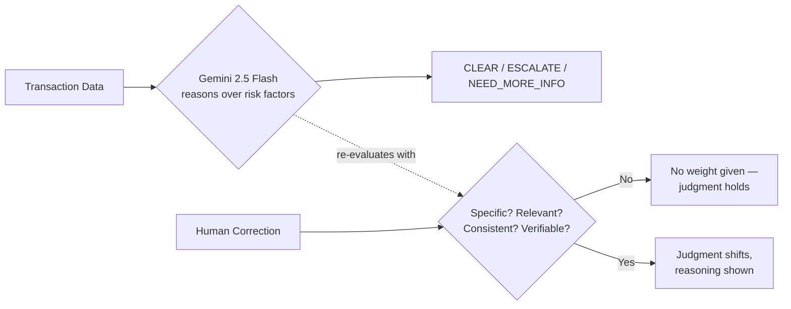

# AI Compliance Judgment Agent

A live, working proof that Zamp's Pace philosophy — brief the AI once, let it run, get it sharper from correction, not from re-prompting — holds up in a high-stakes domain: AML/compliance risk judgment.

**Live app:** [ai-compliance-agent-4vyr7uhwaeervbls8noehm.streamlit.app](https://ai-compliance-agent-4vyr7uhwaeervbls8noehm.streamlit.app)

---

## What it does

Reviews a transaction and reaches one of three conclusions: `CLEAR`, `ESCALATE`, or `NEED_MORE_INFO`. A human can inject a correction mid-session — the agent has to actually weigh it, not just obey it.



The correction-weighing logic lives entirely in the system prompt as *criteria*, not a scripted outcome — the model isn't told what to conclude for any named transaction, it's told how to judge whether a correction earns trust. See `SYSTEM_PROMPT` in `interface.py`.

## Why this design, specifically

A vague correction ("trust me, it's fine") and a specific, checkable one ("PO #4471 confirmed, third payment to this vendor") should not be treated the same. Most "AI agent" demos fake this — either hardcoding the demo's outcome, or blindly trusting whatever a human types. This one does neither:

- **No scripted outcomes.** No transaction has special-cased logic in the prompt.
- **No fallback engine.** If the live Gemini call fails, the app shows a real, visible error — it does not silently drop to local keyword-matching dressed up as AI reasoning.
- **Retry logic distinguishes transient rate limits from hard quota exhaustion**, so it doesn't stall on a failure that retrying can't fix.

These weren't the first version. Two earlier iterations had a fake audio-transcription feature and a hardcoded prompt instruction forcing one transaction to always resolve `CLEAR`. Both were found and removed before this version — the commit history reflects that.

## Stack

- `streamlit` — UI
- `google-genai` — Gemini 2.5 Flash, live calls only, `temperature=0.1`

## Running it locally

```bash
pip install -r requirements.txt
# add GEMINI_API_KEY to .streamlit/secrets.toml
streamlit run interface.py
```

## Where this goes next

- Connect to a real sanctions/data source instead of typed claims
- Make every decision + correction assessment exportable as an audit trail
- This is the direction I'd take it inside Pace's compliance layer
